# Project File Tree

This document provides a comprehensive overview of the project's file and directory structure.

## File Map

```
.
├── GOVERNANCE.md
├── README.md
├── blueprint.md
├── eslint.config.js
├── firebase.json
├── firestore.indexes.json
├── firestore.rules
├── index.html
├── package-lock.json
├── package.json
├── storage.rules
├── vite.config.js
├── .idx
│   ├── dev.nix
│   ├── icon.png
│   └── mcp.json
├── functions
│   ├── index.js
│   ├── package-lock.json
│   └── package.json
├── public
│   ├── index.html
│   ├── run-summary.html
│   ├── run-summary.js
│   └── vite.svg
└── src
    ├── assets
    │   └── react.svg
    ├── components
    │   ├── CompanyOverview
    │   │   ├── index.jsx
    │   │   └── style.module.css
    │   ├── ConfirmationModal
    │   │   ├── ConfirmationModal.module.css
    │   │   └── index.jsx
    │   ├── EventCard
    │   │   ├── index.jsx
    │   │   └── style.module.css
    │   ├── Footer
    │   │   ├── Footer.module.css
    │   │   └── index.jsx
    │   ├── Logo
    │   │   ├── index.jsx
    │   │   └── style.css
    │   ├── Sidebar
    │   │   ├── Sidebar.module.css
    │   │   └── index.jsx
    │   ├── SidebarButton
    │   │   ├── SidebarButton.module.css
    │   │   └── index.jsx
    │   └── UpdateDBModal
    │       ├── UpdateDBModal.module.css
    │       └── index.jsx
    ├── features
    │   ├── DataFix
    │   │   └── index.jsx
    │   ├── IngestCSV
    │   │   ├── index.jsx
    │   │   └── style.module.css
    │   └── IngestionModal
    │       ├── IngestionModal.module.css
    │       └── index.jsx
    ├── hooks
    │   └── useIngestion.js
    ├── index.css
    ├── main.jsx
    ├── pages
    │   ├── Admin
    │   │   ├── index.jsx
    │   │   └── style.module.css
    │   ├── App
    │   │   ├── index.jsx
    │   │   └── style.css
    │   ├── DataFix
    │   │   ├── index.jsx
    │   │   └── style.module.css
    │   ├── Home
    │   │   ├── index.jsx
    │   │   └── style.module.css
    │   ├── Report
    │   │   ├── index.jsx
    │   │   └── style.module.css
    │   └── Show
    │       ├── index.jsx
    │       └── style.module.css
    ├── services
    │   ├── firebase
    │   │   └── index.js
    │   └── ingestion.js
    └── styles
        ├── components
        │   └── button.css
        ├── components.css
        ├── index.css
        └── variables.css
```

## Mermaid Diagram

```mermaid
graph TD
    A[.] --> B[GOVERNANCE.md];
    A --> C[README.md];
    A --> D[blueprint.md];
    A --> E[eslint.config.js];
    A --> F[firebase.json];
    A --> G[firestore.indexes.json];
    A --> H[firestore.rules];
    A --> I[index.html];
    A --> J[package-lock.json];
    A --> K[package.json];
    A --> L[storage.rules];
    A --> M[vite.config.js];
    A --> N[.idx];
    N --> N1[dev.nix];
    N --> N2[icon.png];
    N --> N3[mcp.json];
    A --> O[functions];
    O --> O1[index.js];
    O --> O2[package-lock.json];
    O --> O3[package.json];
    A --> P[public];
    P --> P1[index.html];
    P --> P2[run-summary.html];
    P --> P3[run-summary.js];
    P --> P4[vite.svg];
    A --> Q[src];
    Q --> Q1[assets];
    Q1 --> Q1_1[react.svg];
    Q --> Q2[components];
    Q2 --> Q2_1[CompanyOverview];
    Q2_1 --> Q2_1_1[index.jsx];
    Q2_1 --> Q2_1_2[style.module.css];
    Q2 --> Q2_2[ConfirmationModal];
    Q2_2 --> Q2_2_1[ConfirmationModal.module.css];
    Q2_2 --> Q2_2_2[index.jsx];
    Q2 --> Q2_3[EventCard];
    Q2_3 --> Q2_3_1[index.jsx];
    Q2_3 --> Q2_3_2[style.module.css];
    Q2 --> Q2_4[Footer];
    Q2_4 --> Q2_4_1[Footer.module.css];
    Q2_4 --> Q2_4_2[index.jsx];
    Q2 --> Q2_5[Logo];
    Q2_5 --> Q2_5_1[index.jsx];
    Q2_5 --> Q2_5_2[style.css];
    Q2 --> Q2_6[Sidebar];
    Q2_6 --> Q2_6_1[Sidebar.module.css];
    Q2_6 --> Q2_6_2[index.jsx];
    Q2 --> Q2_7[SidebarButton];
    Q2_7 --> Q2_7_1[SidebarButton.module.css];
    Q2_7 --> Q2_7_2[index.jsx];
    Q2 --> Q2_8[UpdateDBModal];
    Q2_8 --> Q2_8_1[UpdateDBModal.module.css];
    Q2_8 --> Q2_8_2[index.jsx];
    Q --> Q3[features];
    Q3 --> Q3_1[DataFix];
    Q3_1 --> Q3_1_1[index.jsx];
    Q3 --> Q3_2[IngestCSV];
    Q3_2 --> Q3_2_1[index.jsx];
    Q3_2 --> Q3_2_2[style.module.css];
    Q3 --> Q3_3[IngestionModal];
    Q3_3 --> Q3_3_1[IngestionModal.module.css];
    Q3_3 --> Q3_3_2[index.jsx];
    Q --> Q4[hooks];
    Q4 --> Q4_1[useIngestion.js];
    Q --> Q5[index.css];
    Q --> Q6[main.jsx];
    Q --> Q7[pages];
    Q7 --> Q7_1[Admin];
    Q7_1 --> Q7_1_1[index.jsx];
    Q7_1 --> Q7_1_2[style.module.css];
    Q7 --> Q7_2[App];
    Q7_2 --> Q7_2_1[index.jsx];
    Q7_2 --> Q7_2_2[style.css];
    Q7 --> Q7_3[DataFix];
    Q7_3 --> Q7_3_1[index.jsx];
    Q7_3 --> Q7_3_2[style.module.css];
    Q7 --> Q7_4[Home];
    Q7_4 --> Q7_4_1[index.jsx];
    Q7_4 --> Q7_4_2[style.module.css];
    Q7 --> Q7_5[Report];
    Q7_5 --> Q7_5_1[index.jsx];
    Q7_5 --> Q7_5_2[style.module.css];
    Q7 --> Q7_6[Show];
    Q7_6 --> Q7_6_1[index.jsx];
    Q7_6 --> Q7_6_2[style.module.css];
    Q --> Q8[services];
    Q8 --> Q8_1[firebase];
    Q8_1 --> Q8_1_1[index.js];
    Q8 --> Q8_2[ingestion.js];
    Q --> Q9[styles];
    Q9 --> Q9_1[components];
    Q9_1 --> Q9_1_1[button.css];
    Q9 --> Q9_2[components.css];
    Q9 --> Q9_3[index.css];
    Q9 --> Q9_4[variables.css];
```


